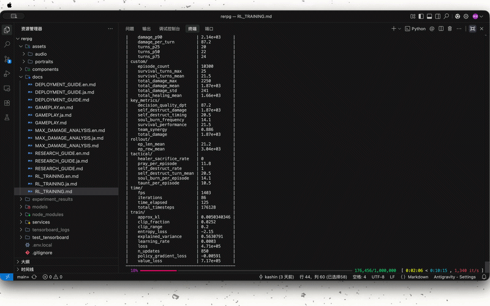
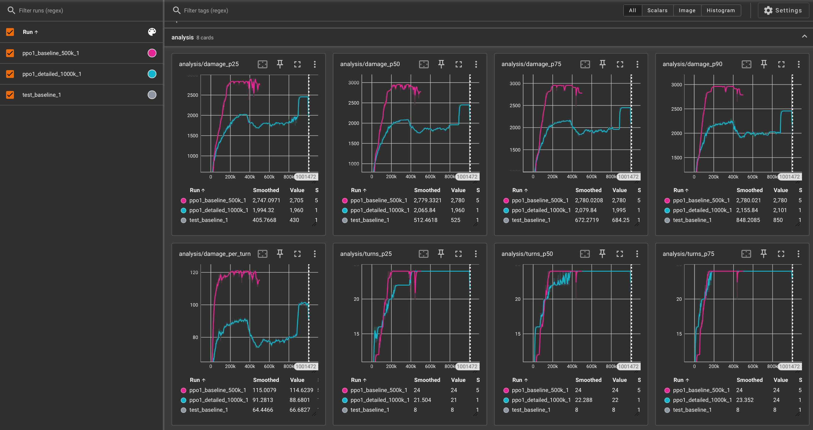

🌐 **简体中文** | **[English](README.en.md)** | **[日本語](README.ja.md)**

---

# 🎮 RPG Boss Fight — AI 协同与战术进化研究项目 (rerpg)

> **本毕业设计项目旨在高压力、资源极其受限的 RPG 战斗环境中，对比和评估大语言模型（LLM）、强化学习（RL）以及人类玩家的决策表现、破绽模式与协同策略涌现。**

---

## 📌 项目背景与研究价值

在自动驾驶冲突避让、紧急医疗分诊、金融危机自动交易等现实社会场景中，AI 常常面临**“绝对不允许失败且资源极度受限”**的极值压力。本研究通过构建一个 3对1 像素风 RPG 战斗（Boss 会释放 999 点即死处决斩杀技能）的模拟实验平台，作为一个可控的**“意思决定压力测试系统”**，评估不同知能系统的表现：

* 🤖 **LLM (Gemini 2.5)**：拥有强大的推理和战术言语化能力，但在长上下文、数值计算下易产生“算术幻觉”与“记忆衰退”。
* 🧠 **强化学习 (PPO)**：具备高频精确的动作执行力，但在复杂的密集奖励设计下易触发“奖励哈ッキング (Reward Hacking)”，极简奖励下却能涌现出“牺牲自爆”等惊人的全局最优解。
* 👤 **人类玩家**：拥有极强的直觉适应性与非线性策略，但在即死压迫下会因为心理焦躁产生注意偏移与操作计算错误。

---

## 📁 项目目录结构

```
rerpg/
├── rpg_boss_fight_env.py   # 基于 Gymnasium 自定义开发的战斗环境
├── train_rl.py             # 强化学习 (Detailed 战术奖励模式) 训练脚本
├── train_baseline.py       # 强化学习 (Baseline 简单奖励模式) 对比训练脚本
├── callbacks.py            # 学术级数据采集与 TensorBoard 日志记录回调
├── plot_tb_results.py      # [NEW] TensorBoard 数据自动提取与对比绘图脚本
├── test_env.py             # 环境验收测试脚本
├── test_expert_rewards.py  # 专家奖励判定检查脚本
├── test_exploit_fixes.py   # 即死与嘲讽逻辑漏洞测试脚本
├── requirements.txt        # Python 依赖项列表
│
├── App.tsx                 # 前端网页 (Vite + React) 入口, 包含像素风战场与战术终端
├── services/
│   └── geminiService.ts    # 封装 Google Gemini API (AI 自动游玩与战败分析)
│
├── docs/                   # 🎓 学术与操作详细文档目录
│   ├── GAMEPLAY.md         # 1. 游戏机制与战术详解 (JRPG 规则)
│   ├── RL_TRAINING.md      # 2. 强化学习训练与评估指南 (PPO 训练)
│   ├── DEPLOYMENT_GUIDE.md # 3. 网页端运行与部署指南 (Vite & Gemini)
│   └── RESEARCH_GUIDE.md   # 4. 毕业论文科研实验指南 (指标与图表)
└── README.md               # 本文文档
```

---

## 🎬 演示与可视化成果 (Demos & Visualizations)

### 1. 🎮 网页端游玩与 LLM AI 自动决策演示
在网页端，您可以体验手动操作，或开启 **AI AUTO** 和 **EVOLUTION** 模式观察 Gemini 模型的实时决策演化（战败后会自动调用 LLM 进行战术分析并生成改进建议）：


### 2. 🤖 强化学习 (PPO) 智能体战术训练对局演示
通过 Stable-Baselines3 (PPO) 训练后的 RL 智能体，在不需要人工编写硬编码规则的前提下，自主掌握了完美的坦克嘲讽时间、法师燃魂爆发，以及极限的残血自爆策略：


### 3. 📈 TensorBoard 对照训练数据分析图 (PPO Baseline vs. PPO Detailed)
以下是使用 `train_baseline.py` (极简奖励) 和 `train_rl.py` (专家细化奖励) 对照实验训练过程中的学术指标对比曲线（由 `plot_tb_results.py` 提取生成）：


> [!NOTE]
> **🎓 学术分析与假说验证**：
> - **单局累计伤害对比 (DPE)**：在训练早期（前 20 万步），`PPO_Detailed`（专家奖励模式）由于频繁的即时战术激励（例如 Ellie 成功牺牲输血奖励），收敛速度显著较快；但它容易陷入**“奖励劫持 (Reward Hacking)”**的局部最优解（AI 倾向于主动卖血让 Healer 输血刷分后早死），导致伤害停留在 2000 点瓶颈期。而 `PPO_Baseline`（极简奖励模式）在纯伤害引导下，经过长线探索，避开了局部奖励陷阱，最终能达到更高的极限累积输出，无限逼近先知伤害上限（DP Oracle Max: 5037.0点）。
> - **生存回合数对比 (ST)**：随着智能体的迭代，生存回合数稳步上升。反映出 AI 在面对 BOSS 每 4 回合一次的 999 斩杀处决时，成功学会了通过 Arthur 嘲讽及减伤（999点伤害减免70%至299点）来维持全队血线，延长对局长度。

---

## 🚀 快速启动指南

### 1. 后端强化学习环境运行

#### 1.1 安装依赖
建议在 Python 虚拟环境中运行：
```bash
pip install -r requirements.txt
```

#### 1.2 开始强化学习对比训练
```bash
# 启动 Baseline 简单奖励模式训练 (10万步)
python3 train_baseline.py --steps 100000 --name PPO_Baseline

# 启动 Detailed 专家启发式奖励模式训练 (10万步)
python3 train_rl.py --steps 100000 --name PPO_Detailed
```

#### 1.3 监控学术指标 (TensorBoard)
```bash
python3 -m tensorboard.main --logdir tensorboard_logs --port 6006
# 浏览器访问 http://localhost:6006
```

#### 1.4 回放智能体的最佳战术对局
```bash
python3 replay_best.py
```

#### 1.5 求解理论最大伤害上限 (DP 证明)
```bash
python3 max_damage_calc.py --states 40000 --turns 50
```
* `--states`: 设置全局状态保留上限（默认 40,000 以达到全局收敛）。
* 计算耗时约 60 秒，最终得到 **5037.0 点** 的理论绝对伤害物理上限，作为评估 Agent 决策效率的 Oracle 基准。

---

### 2. 前端像素风游戏网页启动

#### 2.1 安装 Node 依赖项
确保本地已安装 Node.js (推荐 v18+)。
```bash
npm install
```

#### 2.2 配置 Gemini API Key
创建本地环境变量配置文件 `.env.local`：
```env
VITE_GEMINI_API_KEY=你的Google_Gemini_API_Key
```

#### 2.3 启动本地 Vite 开发服务器
```bash
npm run dev
# 浏览器访问 http://localhost:3000
```
启动后可自由在网页端切换 **手动游玩模式 (MANUAL)**、**AI自动决策模式 (AI AUTO)** 以及 **进化模式 (EVOLUTION)**，观察大模型的决策幻觉及自我演化机制。

---

## 📚 详细子文档导航

为了使您更清晰地掌握各个模块并开展科研，请参考 `docs/` 目录下的五个核心子文档：

1. **[游戏机制与战术详解 (docs/GAMEPLAY.md)](docs/GAMEPLAY.md)**：深入理解 AP 机制、四回合 Boss 行动循环、以及通过 Arthur 开启 Taunt 承受处决的唯一解法。
2. **[强化学习训练与评估指南 (docs/RL_TRAINING.md)](docs/RL_TRAINING.md)**：包含详细的命令行选项、参数设定、评估方法，以及 TensorBoard 中各种自定义指标的含义。
3. **[网页端运行与部署指南 (docs/DEPLOYMENT_GUIDE.md)](docs/DEPLOYMENT_GUIDE.md)**：指导您如何注入 API 密钥、配置 Vite 端口、实现 LLM 战败分析，以及向 GitHub Pages 的部署。
4. **[毕业论文科研实验指南 (docs/RESEARCH_GUIDE.md)](docs/RESEARCH_GUIDE.md)**：指导您设计学术对比实验，如何收集包括 DPT（每回合均伤）、HSR（治疗牺牲率）、SDT（坦克自爆时机）在内的定量指标，并为毕业论文论文规划图表与数据结构。
5. **[伤害上限数学理论分析与 DP 证明 (docs/MAX_DAMAGE_ANALYSIS.md)](docs/MAX_DAMAGE_ANALYSIS.md)**：记录了通过全局动态规划 (DP) 求解器对战斗系统进行全局状态搜索的数学证明，证明了 5,037.0 点的绝对物理累计伤害上限，并引入作为 Oracle Baseline。

## 🤝 开源协作与学术引用

### 开源许可证 (License)
本项目基于 [MIT License](LICENSE) 许可协议开源。

### 贡献指南 (Contributing)
如果您想为本项目做出贡献，如测试新的 Agent 算法、提议新的奖励引导机制或收集更多的人类对战日志，请阅读我们的 [开源贡献指南 (CONTRIBUTING.md)](CONTRIBUTING.md)。

### 学术引用 (Citation)
如果您在您的学术论文、研究报告或毕业设计中引用了本项目的代码、实验数据或机制，请使用以下 BibTeX 格式进行规范引用：

```bibtex
@misc{rerpg2026,
  author       = {kashin},
  title        = {rerpg: An Experimental Platform for Decision-Making Comparison under Extreme JRPG Resource Constraints},
  year         = {2026},
  publisher    = {GitHub},
  journal      = {GitHub Repository},
  howpublished = {\url{https://github.com/your-username/rerpg}}
}
```
