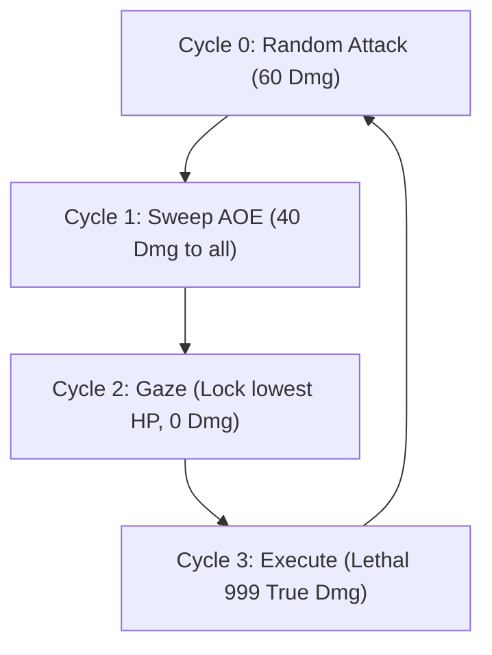

🌐 **[简体中文](GAMEPLAY.md)** | **English** | **[日本語](GAMEPLAY.ja.md)**

---

# 🎮 Game Mechanics & Tactics Detailed (GAMEPLAY)

The core experimental platform of this graduation research is a carefully designed high-pressure, resource-constrained JRPG battle environment (custom-developed based on Gymnasium). This environment is not designed for entertainment, but rather as a **controllable stress-testing system designed to evaluate the limits of survival and trade-off decisions made by different cognitive architectures (Reinforcement Learning, Large Language Models, Humans)**.

---

## 1. Basic Rules

The game is a **3-vs-1 turn-based Boss battle**. The player (or agent) simultaneously controls 3 distinct classes of heroes.

### 1.1 Core Resource: Action Points (AP)
* **Initial & Cap**: Each character starts the battle with **3 AP**, which is also the maximum AP limit.
* **Recovery**: At the start of each turn, if a character is alive and has less than 3 AP, they **automatically recover 1 AP**.
* **Wait Action (WAIT)**: A character can choose to `WAIT`. This action consumes 0 AP, allowing the character to stockpile resources for subsequent burst turns. Waiting when already at 3 AP will cause the recovery point to overflow and be wasted.

### 1.2 Turn Execution Order
The turn order is strictly fixed and is crucial for tactical planning:
$$\text{Arthur (Tank)} \rightarrow \text{Merlin (Mage)} \rightarrow \text{BOSS (Abyssal Demon)} \rightarrow \text{Ellie (Healer)}$$

> [!IMPORTANT]
> **Healer Attentional Delay**: Because Ellie acts after the Boss, she can only heal targets *after* the Boss has already inflicted damage. This requires Ellie's controller to possess strong anticipatory awareness.

---

## 2. Character Attributes & Skills

Each character can choose `WAIT` (0 AP) or one of three unique class skills:

### 🛡️ Arthur (Tank)
* **Role**: Primary survival line, damage absorber.
* **Attributes**: Max HP: `450`
* **Skills**:
  1. **Shield Bash** — `1 AP`: Inflicts `20` damage to the Boss and grants Arthur a `30`-point shield. Shields are only valid for the current turn and vanish at the turn's end.
  2. **Taunt** — `2 AP`: Draws Boss aggro, forcing the Boss's next attack to target Arthur. It also grants Arthur **70% damage reduction** during the current turn (cleared after the Boss acts).
  3. **Self-Destruct** — `0 AP`: Sacrifices all remaining HP to deal damage equal to **25% of the total cumulative damage dealt by the team so far**. Arthur is instantly set to dead status. Best used as a finisher or in a desperate final turn.

### 🔥 Merlin (Mage)
* **Role**: Primary magic damage output (Glass Cannon).
* **Attributes**: Max HP: `200`
* **Skills**:
  1. **Missile** — `1 AP`: Deals `60` base damage.
  2. **Fireball** — `2 AP`: Deals `150` high damage.
  3. **Soul Burn** — `3 AP`: Deals `280` burst damage, but inflicts `40` self-damage on Merlin due to mana backlash. With only 200 Max HP, frequent use is highly risky.

### 💚 Ellie (Healer)
* **Role**: Team status keeper, resource converter.
* **Attributes**: Max HP: `250`
* **Skills**:
  1. **Heal** — `1 AP`: Restores `60` HP to a single target (can target herself).
  2. **Pray** — `2 AP`: Holy area heal, restoring `40` HP to all surviving teammates.
  3. **Transfusion** — `0 AP`: Emergency lifeline. Restores `150` HP to a single target other than herself, but inflicts `60` self-damage on Ellie. Used when AP is depleted.

---

## 3. BOSS (Abyssal Demon) Action Cycle

The Boss's maximum HP is set to **5000 HP** across all environments. There is no early win condition (killing the boss early). The battle continues until the 50-turn cap is reached or the team is wiped out, and the cumulative damage is recorded. The Boss operates on a strict, predictable **4-turn cycle**:

* **Cycle 0: Random Single Attack**: Deals `60` damage. Can be intercepted by Arthur's Taunt.
* **Cycle 1: Sweep AOE**: Deals `40` damage to all surviving characters. This is the optimal window to use Ellie's Pray.
* **Cycle 2: Gaze**: Deals `0` damage but applies a "Death Mark" (Gaze) to the surviving character with the **lowest current HP**.
* **Cycle 3: Execute**: Deals `999` true damage to the gazed target. Unless mitigated, the target dies instantly.

---

## 4. Extreme Survival Tactics: The Taunt Defense Loop

Mitigating the Boss's Cycle 3 Execute is the primary challenge of this system.

### The Only Survivable Defense Strategy
To prevent glass cannons (Mage or Healer) from being instantly executed, the team must execute this loop:
1. **Cycle 2 (Gaze Turn)**:
   * Boss targets the lowest-HP character.
   * Ellie must heal proactively to ensure Arthur's HP remains above the execution survival threshold (since Arthur's Taunt reduces the 999 damage by 70%, he still takes 299 true damage; thus, Arthur's HP must be kept above `300`).
2. **Cycle 3 (Execute Turn)**:
   * Arthur must cast **Taunt** (costs `2 AP`).
   * The Boss's target shifts to Arthur.
   * Arthur takes `299` true damage and survives.
   * After the Boss acts, Gaze and Taunt statuses are cleared.

### Failure Indicators under Stress
* **Poor AP Management**: If Arthur wastes AP in prior turns and lacks `2 AP` on Cycle 3, he cannot Taunt, leading to an instant team death.
* **Poor HP Management**: If Arthur Taunts but has less than 300 HP, he will die intercepting the blow.
* **Context Hallucination/Memory Drift**: If the agent loses track of the current cycle count, casting Taunt on random turns and missing it on execution turns leads to rapid team collapse.
