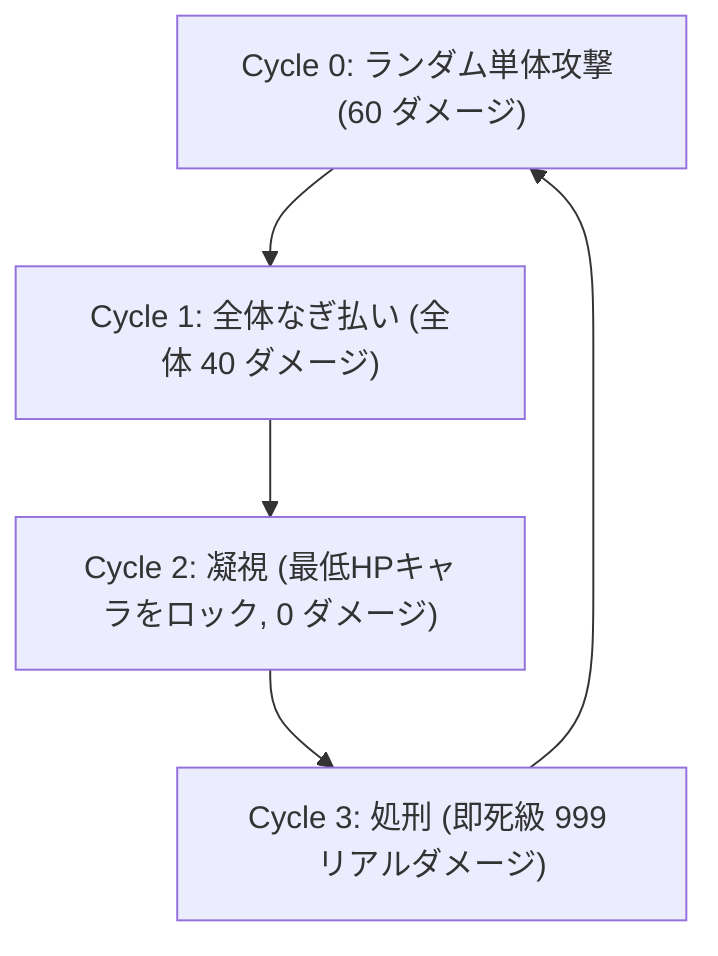

🌐 **[简体中文](GAMEPLAY.md)** | **[English](GAMEPLAY.en.md)** | **日本語**

---

# 🎮 ゲームメカニクスと戦術詳細 (GAMEPLAY)

本卒業研究のコアとなる実験プラットフォームは、綿密に設計された高ストレス・リソース制限型のJRPG戦闘環境です（Gymnasiumをベースにカスタム開発）。この環境は一般的な娯楽用ゲームではなく、**多様な意思決定エージェント（強化学習、大規模言語モデル、人間）が極限の生存状況下でトレードオフを伴う決定を下す能力を測定するための、制御可能な意思決定ストレス評価システム**です。

---

## 1. 基本ルール設定

ゲームは**3対1のターン制ボス戦**です。プレイヤー（またはエージェント）は、異なるクラスの3人のキャラクターを同時に操作します。

### 1.1 コア資源：行動ポイント (AP)
* **初期値と上限**：各キャラクターは戦闘開始時に **3 AP** を所持しており、これが最大AP制限となります。
* **回復メカニクス**：各ターン開始時、生存しているキャラクターのAPが3未満の場合、**自動的に 1 AP が回復**します。
* **待機 (WAIT)**：キャラクターは `WAIT`（待機）を選択できます。この行動は 0 AP を消費し、後続の爆発的ターンに備えてAPを温存できます。すでに3 APの状態で待機すると、回復分が溢れて浪費されます。

### 1.2 行動順序 (Turn Order)
行動順は厳格に固定されており、戦術設計において極めて重要です：
$$\text{Arthur (タンク)} \rightarrow \text{Merlin (魔法使い)} \rightarrow \text{BOSS (深淵の悪魔)} \rightarrow \text{Ellie (回復士)}$$

> [!IMPORTANT]
> **回復のタイムラグ設計**：回復士であるEllieの行動順はボスの後であるため、ボスがダメージを与えた後の「後手」でしか回復を行えません。これはEllieの操作者（またはエージェント）に極めて高い**先読み意識**を要求します。

---

## 2. キャラクター属性とスキルシステム

各キャラクターは `WAIT` (0 AP) の他に、それぞれ3つの固有スキルを持っています：

### 🛡️ Arthur (タンク)
* **役割**：チームの生存ライン、ダメージの引き受け役。
* **属性**：最大 HP: `450`
* **スキルリスト**：
  1. **盾撃 (Shield Bash)** — `1 AP`：ボスに `20` ダメージを与え、自身に `30` ポイントのシールドを付与します。シールドは現在のターンのみ有効で、ターン終了時に消失します。
  2. **嘲諷 (Taunt)** — `2 AP`：ボスのヘイトを集め、ボスの次の単体攻撃の対象を強制的に自身に向けます。さらに、現在のターンにおいて自身が受けるダメージを **70% 軽減**します（ボス行動後に消失）。
  3. **自爆 (Self Destruct)** — `0 AP`：自身の全HPを犠牲にし、**チームがそれまでに与えた累計ダメージの 25%** に相当する大ダメージをボスに与えます。Arthurは即座に死亡判定となります。トドメを刺す際や、全滅直前の最後のターンに有効です。

### 🔥 Merlin (魔法使い)
* **役割**：魔法による主力アタッカー（ガラスの大砲）。
* **属性**：最大 HP: `200`
* **スキルリスト**：
  1. **魔法矢 (Missile)** — `1 AP`：`60` の基礎ダメージを与えます。
  2. **火球 (Fireball)** — `2 AP`：`150` の高ダメージを与えます。
  3. **魂燃焼 (Soul Burn)** — `3 AP`：`280` の爆発的ダメージを与えますが、魔力の反動で自身も `40` ダメージを受けます。最大HPが200しかないため、頻繁に使用すると自滅のリスクがあります。

### 💚 Ellie (回復士)
* **役割**：チームのHP維持、リソース変換の要。
* **属性**：最大 HP: `250`
* **スキルリスト**：
  1. **治癒 (Heal)** — `1 AP`：単一の対象（自身を含む）のHPを `60` 回復します。
  2. **祈り (Pray)** — `2 AP`：全体回復スキル。生存している全味方のHPを `40` 回復します。
  3. **輸血 (Transfusion)** — `0 AP`：緊急救命スキル。自身以外の単一対象のHPを `150` 回復しますが、自身は `60` ダメージを受けます。APが枯渇している場合の強引なHP入れ替えに用います。

---

## 3. BOSS (深淵の悪魔) 行動サイクル

ボスの最大HPはすべての環境で **5000 HP** に統一設定されています。早期勝利条件（ボスを早期に撃破してゲーム終了）はなく、戦闘は50ターン上限に達するか、チームが全滅するまで継続し、その間に与えた累積ダメージを記録します。ボスは厳格な **4ターン固定サイクル** で行動します：

* **Cycle 0: ランダム単体攻撃**：`60` ダメージを与えます。Arthurの「嘲諷」で引き受け可能です。
* **Cycle 1: なぎ払い攻撃 (AOE)**：生存している全キャラクターに `40` ダメージを与えます。Ellieの「祈り」による全体回復の絶好のタイミングです。
* **Cycle 2: 凝視 (Gaze)**：ダメージはありませんが、現在**HPが最も低い**生存キャラクターに「死の刻印」を付与します。
* **Cycle 3: 処刑 (Execute)**：マークされたキャラクターに致命的な一撃を放ち、`999` のリアルダメージ（固定ダメージ）を与えます。防衛手段がない場合、対象は即死します。

---

## 4. 極限生存戦術：「嘲諷（Taunt）」ループ

ボスの Cycle 3 処刑をいかに防ぐかが、本システムにおける最大の攻略要素です。

### 唯一の生存戦略
耐久力の低い脆い味方（魔法使いや回復士）が Cycle 3 で即死するのを防ぐには、以下の連携を完璧に行う必要があります：
1. **Cycle 2 (凝視ターン)**：
   * ボスは最低HPのキャラクターをロックします。
   * Ellieは事前に回復を行い、Arthur（タンク）のHPが処刑時の被ダメージ（999ダメージの70%軽減後は299ダメージとなるため、最低でも `300` 以上）を上回るように調整し、Arthurが全生存キャラクターの中で最低HPになるように誘導します。
2. **Cycle 3 (処刑ターン)**：
   * Arthurは **嘲諷 (Taunt)** を使用します（`2 AP` 消費）。
   * ボスの攻撃対象は強制的に Arthur に引き写されます。
   * Arthurは70%軽減を発動し、`299` ダメージを受けて生存します。
   * ボスの行動後、凝視マークと嘲諷状態はクリアされます。

### ストレス下での決定崩壊パターン
* **不適切なAP管理**：Arthurが前のターンでAPを使い果たし、Cycle 3 で 2 AP を確保できない場合、嘲諷を使用できず即座に崩壊します。
* **不適切なHP管理**：Arthurが嘲諷を使用できても、HPが300未満の場合は、身代わりとなった段階で撃破されます。
* **記憶の減退と幻覚**：エージェントが現在のサイクル数を追跡できず、処刑以外のターンでAPを浪費したり、処刑ターンに嘲諷を忘れたりすると、チームは瞬時に全滅します。
