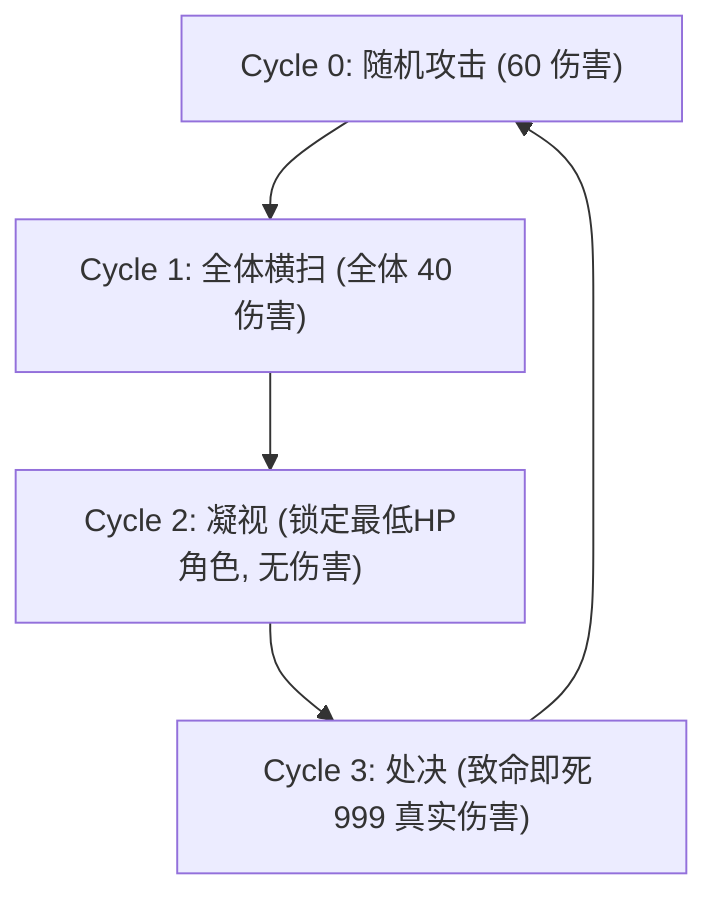

🌐 **简体中文** | **[English](GAMEPLAY.en.md)** | **[日本語](GAMEPLAY.ja.md)**

---

# 🎮 游戏机制与战术详解 (GAMEPLAY)

本毕业研究的核心实验平台是一个精心设计的高压力、资源受限型 JRPG 战斗环境（基于 Gymnasium 自定义开发）。该环境不是一个常规的娱乐游戏，而是一个**用于测试各种决策智能体（强化学习、大规模语言模型、人类）在极限生存和权衡决策下表现的压力测试系统**。

---

## 1. 基础规则设定

游戏采用**3对1的回合制 Boss 战**。玩家（或智能体）同时控制 3 个不同职业的冒险者角色。

### 1.1 核心资源：行动点 (AP)
* **起始与上限**：每个角色在战斗开始时拥有 **3点 AP**，AP 上限为 **3点**。
* **回复机制**：在每个回合开始时，若角色存活且当前 AP 不足 3点，则**自动回复 1点 AP**。
* **空过机制 (WAIT)**：角色可选择 `WAIT`（待机），本回合不消耗 AP，相当于保存资源以供后续回合爆发使用。如果 AP 已经是 3点而选择待机，则会导致 AP 溢出浪费。

### 1.2 回合行动顺序 (Turn Order)
行动顺序是严格固定的，这对战术判定至关重要：
$$\text{Arthur (坦克)} \rightarrow \text{Merlin (法师)} \rightarrow \text{BOSS (深渊恶魔)} \rightarrow \text{Ellie (治疗师)}$$

> [!IMPORTANT]
> **治疗滞后设计**：由于治疗师 Ellie 的行动顺序在 Boss 之后，这意味着 Ellie 只能在 Boss 造成伤害后才能进行补救治疗。这要求 Ellie 的操作者必须具备极强的**预判意识**。

---

## 2. 角色属性与技能系统

每个角色除了基础的 `WAIT` (消耗 0 AP 待机) 外，各自拥有 3 个专属技能：

### 🛡️ Arthur (坦克)
* **定位**：队伍的生存防线、伤害承接者。
* **属性**：最大 HP: `450`
* **技能表**：
  1. **盾击 (Shield Bash)** — `1 AP`：对 Boss 造成 `20` 点伤害，并为自身提供 `30` 点护盾。护盾仅在当前回合有效，回合结束时清零。
  2. **嘲讽 (Taunt)** — `2 AP`：吸引 Boss 仇恨，强制 Boss 下一次攻击转向自己，并使自身在当前回合获得 **70% 伤害减免**。该状态在 Boss 行动后立即失效。
  3. **自爆 (Self Destruct)** — `0 AP`：牺牲自身生命值，对 Boss 造成等同于**队伍历史累计已造成伤害的 25%** 的高额伤害，自身直接判定死亡。适合作为终结技或绝望关头的最终输出。

### 🔥 Merlin (法师)
* **定位**：核心魔法输出（玻璃大炮）。
* **属性**：最大 HP: `200`
* **技能表**：
  1. **魔法飞弹 (Missile)** — `1 AP`：造成 `60` 点基础伤害。
  2. **火球术 (Fireball)** — `2 AP`：造成 `150` 点高额伤害。
  3. **燃魂 (Soul Burn)** — `3 AP`：造成 `280` 点爆发伤害，但自身由于法力反噬受到 `40` 点自伤。由于血量仅 `200`，频繁使用容易导致暴毙。

### 💚 Ellie (治疗师)
* **定位**：全队状态维系者、资源转换枢纽。
* **属性**：最大 HP: `250`
* **技能表**：
  1. **治疗术 (Heal)** — `1 AP`：为单一目标（可为自身）恢复 `60` 点 HP。
  2. **祈祷 (Pray)** — `2 AP`：群体神圣治疗，为所有存活的队友恢复 `40` 点 HP。
  3. **输血 (Transfusion)** — `0 AP`：紧急救场技能，为除自身外的单体目标恢复 `150` 点大量 HP，但自身受到 `60` 点自伤。用于 AP 枯竭时强行换血救人。

---

## 3. BOSS (深渊恶魔) 行为循环

Boss 的血量在所有端（网页端、强化学习环境、数学计算）均统一设定为 **5000 HP**。该战斗不设定早退/提前获胜条件，战斗将持续进行，直到达到 50 回合上限或我方队伍全灭，最终记录在此期间造成的累计伤害值。Boss 的攻击拥有严格的 **4回合固定循环**。智能体必须记住当前的 `Boss Cycle` 以做应对：

* **Cycle 0: 随机单体攻击**：造成 `60` 点伤害。可被 Arthur 的嘲讽拦截。
* **Cycle 1: 横扫攻击 (AOE)**：造成全体 `40` 点伤害。这是触发 Ellie 祈祷群体恢复的黄金时机。
* **Cycle 2: 凝视 (Gaze)**：不造成任何伤害，但会对当前**生命值最低**的存活角色施加“死亡印记”。
* **Cycle 3: 处决 (Execute)**：对被标记的角色降下致命一击，造成 `999` 点真实伤害（若无防御手段，目标必死）。

---

## 4. 极限生存战术：Taunt 生存博弈

本游戏最硬核、也是最核心的考验，在于**如何应对 Cycle 3 的处决攻击**。

### 唯一生还解法
要避免脆皮（法师或治疗师）在 Cycle 3 被直接斩杀，必须实施以下完美联防：
1. **Cycle 2 (凝视轮)**：
   * Boss 将锁定最低 HP 角色。
   * 治疗师 Ellie 必须在这轮行动中（在 Boss 凝视锁定后）进行预判治疗，确保坦克 Arthur 的血量在 Boss 的处决线之上（由于处决打在 Arthur 身上并减免 70% 后仍有约 `300` 点伤害，因此 Arthur 的血量必须保持在 `300` 以上）。
2. **Cycle 3 (处决轮)**：
   * 坦克 Arthur 必须使用 **嘲讽 (Taunt)**（消耗 `2 AP`）。
   * Boss 行动时，攻击目标由于嘲讽被强制转移到 Arthur 身上。
   * Arthur 触发 70% 减免，只承受约 `300` 点真实伤害并存活。
   * Boss 行动后，Arthur 的 Taunt 状态和 Boss 的 Gaze 标记被一并清除。

### 失败的诱因（高压表现）
* **AP 管理不善**：如果 Arthur 在之前的轮次中频繁使用盾击导致 AP 不足 2点，在 Cycle 3 将无法开出嘲讽，导致被标记角色必死。
* **血量管理不善**：如果 Arthur 在 Cycle 3 虽然成功嘲讽，但其当前 HP 低于 300，他将在替队友挡刀时直接被击杀。
* **记忆丧失或幻觉**：智能体如果无法准确跟踪 Cycle 状态，在非处决轮浪费 AP 开嘲讽，或在处决轮忘记开嘲讽，都会导致团队瞬间土崩瓦解。
